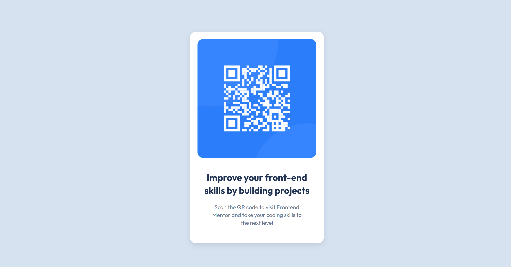

# Frontend Mentor - QR code component solution

This is my solution for the Frontend Mentor QR code challenge (https://www.frontendmentor.io/challenges/qr-code-component-iux_sIO_H), using HTML and CSS.

## Table of contents

- [Overview](#overview)
  - [Screenshot](#screenshot)
  - [Links](#links)
- [My process](#my-process)
  - [Built with](#built-with)
  - [What I learned](#what-i-learned)
  - [Continued development](#continued-development)
  - [Useful resources](#useful-resources)
- [Author](#author)
- [Acknowledgments](#acknowledgments)

## Overview

### Screenshot

Here is a preview of my solution: 

### Links

- Solution URL: (https://www.frontendmentor.io/solutions/styled-and-structured-component-using-semantic-html-and-css-ramsgsyVlL)
- Live Site URL on GitHub: (https://paloma-cardozo.github.io/QR-code-component/)

## My process

### Built with

- Semantic HTML5 markup
- Flexbox

### What I learned

Working on this project helped me improve my understanding of Flexbox, especially when centering elements and making the layout more responsive. I also focused on using semantic HTML to structure the content better, making it more accessible and organized. Additionally, I paid closer attention to accessibility by ensuring that all content was placed inside proper landmark regions. 

Lastly, I gained valuable experience using GitHub Pages to deploy my project, which was a great way to make my work easily accessible online.

### Continued development

1. Deepening my knowledge of accessibility – I want to keep improving how I structure my HTML to ensure better accessibility, using proper landmarks and semantic elements to enhance usability for everyone.

2. Mastering Flexbox and Grid – While I’ve improved my use of Flexbox, I want to continue refining my layouts by exploring more advanced techniques and incorporating CSS Grid where appropriate.

3. Improving my responsive design skills – I aim to work more intentionally on making designs adapt smoothly to different screen sizes, experimenting with media queries and better layout planning.

4. Enhancing my workflow with Git and GitHub – I want to strengthen my version control skills by using Git more effectively, handling branches, and streamlining my deployment process.

5. Exploring JavaScript for interactivity – This project focused on HTML and CSS, but I’d love to start adding JavaScript to make future projects more dynamic and interactive.

### Useful resources

- [MDN Web Docs](https://developer.mozilla.org/en-US/) - A great reference for HTML and CSS. I used it particularly to understand the best practices for semantic HTML and refine my Flexbox implementation.
- [Google Fonts](https://fonts.google.com/) - I used it to include the 'Outfit' font, which helped enhance the visual consistency and readability of my project.
- [GitHub Docs](https://docs.github.com/en) - Helped me understand the workflow for staging, committing, and pushing changes while deploying my project on GitHub Pages.

## Author

- Frontend Mentor - [@Paloma-Cardozo](https://www.frontendmentor.io/profile/Paloma-Cardozo)
- GitHub URL - [Paloma-Cardozo](https://github.com/Paloma-Cardozo)

## Acknowledgments

First and foremost, I want to express my deepest gratitude to the two most incredible people in my life—my husband and my daughter. Their love, patience, and unwavering support have made every step of this journey even more meaningful. My husband, who has always believed in me, pushed me to keep going, and celebrated every small achievement as if it were the greatest. And my amazing daughter, my greatest inspiration and my biggest cheerleader. This journey would not be the same without them by my side.

I would also like to extend a heartfelt thank you to ReDI School for opening the doors to a whole new world. Through this opportunity, I discovered a passion I never knew I had, and I’m deeply grateful to be part of such an inspiring and supportive learning community.

A special thanks to Frontend Mentor for creating an incredible platform that allows me to practice and grow.

This is just the beginning of an exciting journey, and I can't wait to see where it leads!

